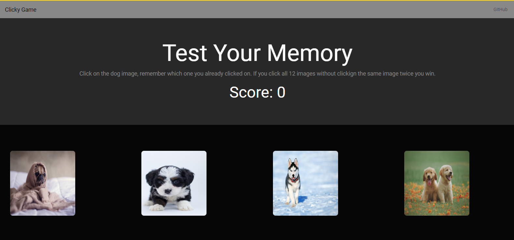

# Clicky Game

### Play this game test your memory

### Deployed Version 




Heroku Link: 

## Getting Started

These instructions will get you a copy of the project up and running on your local machine for development and testing purposes.

### Installing

Clone the repo
```
$ git clone https://github.com/Mhr85/clicky-game.git

```
Install dependencies

```
$ npm i

```

Run the app

```
$ npm start

```
